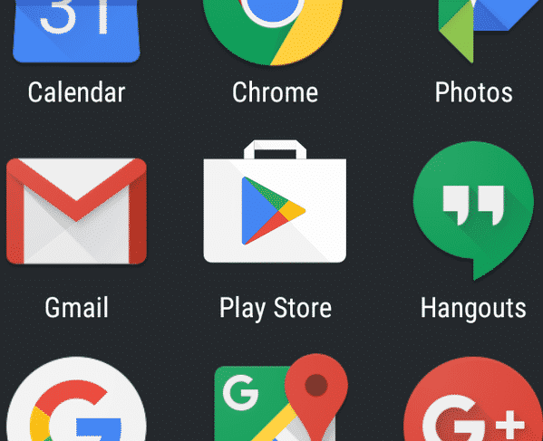

# Build and publish an Ionic app in Play Store
How to build an Android app in Android Studio and publish it in the Google Play Store.

## APK file
APK refers to the Android Package Kit (also Android Application Package) which is used in the Android operating system for the distribution and installation of mobile apps. For instance, you tend to use .exe file for installing software in your PC, similarly, .apk files are used to install Android application on your phone.

## Signed APK file
As for the developer, an unsigned APK file is developed mainly for local testing purposes. Furthermore, these APK files can be made publicly available. However, Google Play Store does not accept these files as unsigned APK files are not secure. Here, an unsigned APK is more like a zipped file that can get unzipped easily without any security. So, in case if the unwanted individuals unzip the files and unzip the APK file, they can have access to the code because of which you may lose your authority to the files.

Now, talking about generating signed APK files, it is secured by a Keystore credential made by the developer and includes a password for the security purpose. Therefore, Signed APK cannot be easily unzipped and mainly used for production purposes. In conclusion, if you are generating a signed APK file, it is more secure and also acceptable in Google Play Store.

## Guide to Generate a signed APK using Android Studio
```bash
$ sudo npm i -g @ionic/cli cordova
$ ionic init
$ ionic serve   # test

## After this, change your ionic.config.json like this
## Before
{
  "name": "ionic-playground",
  "integrations": {
    "cordova": {}
  },
  "type": "angular"
}

## After
{
  "defaultProject": "ionic-playground",
  "projects": {
    "ionic-playground": {
      "name": "ionic-playground",
      "integrations": {
        "cordova": {}
      },
      "type": "angular"
    }
  }
}

## For test
$ ionic cordova prepare android

## Build
$ ionic cordova build android --prod --release

## Generate a signing key
$ keytool -genkey -v -keystore my-release-key.keystore -alias alias_name -keyalg RSA -keysize 2048 -validity 10000

## Once this last command has been ran and its prompts have been answered a file called my-release-key.keystore will be created in the current directory. 

###
### WARNING: Save this file and keep it somewhere safe. If it is 
### lost the Google Play Store will not accept updates for this app!
###

## Sign the app
$ jarsigner -verbose -sigalg SHA1withRSA -digestalg SHA1 -keystore my-release-key.keystore HelloWorld-release-unsigned.apk alias_name

## Optimize the APK
$ zipalign -v 4 HelloWorld-release-unsigned.apk HelloWorld.apk

## This generates a final release binary called HelloWorld.apk that can be accepted into the Google Play Store.
```


UPDATE 

ANDROID RELEASE BUILD (ALWAYS RUN AS ADMIN) 
================================================== 
    Go to folder projecty-app-client (IGNORE COPY ERROR AFTER BUILD) 
        Open file config.xml and increment android-versionCode with +1 
        npm run cordova:build android --release 
    Go to folder \platforms\android\app\build\outputs\apk\release 
        Copy file app-release-unsigned.apk 
    Go to folder C:\Program Files\Java\jdk1.8.0_231\bin 
        Delete app-release-unsigned.apk if file exists. 
        Paste file app-release-unsigned.apk 
        jarsigner -verbose -sigalg SHA1withRSA -digestalg SHA1 -keystore my-release-key.keystore app-release-unsigned.apk alias_name 
        Copy file app-release-unsigned.apk 
    Go to folder C:\Program Files (x86)\Android\android-sdk\build-tools\28.0.3 
        Delete app-release-unsigned.apk if file exists. 
        Delete Welever.apk if file exists. 
        Paste file app-release-unsigned.apk 
        zipalign -v 4 app-release-unsigned.apk Welever.apk 
        apksigner verify --verbose Welever.apk 
 

NEW (FROM SCRATCH) 

ANDROID RELEASE BUILD (ALWAYS RUN AS ADMIN) 
================================================== 
    Go to folder projecty-app-client (IGNORE COPY ERROR AFTER BUILD) 
        npm run cordova:build android --release 
    Go to folder \platforms\android\app\build\outputs\apk\release 
        Copy file app-release-unsigned.apk 
    Go to folder C:\Program Files\Java\jdk1.8.0_231\bin 
        Delete app-release-unsigned.apk if file exists. 
        Delete my-release-key.keystore if file exists. 
        Paste file app-release-unsigned.apk 
        keytool -genkey -v -keystore my-release-key.keystore -alias alias_name -keyalg RSA -keysize 2048 -validity 10000 
        keytool -importkeystore -srckeystore my-release-key.keystore -destkeystore my-release-key.keystore -deststoretype pkcs12 
        jarsigner -verbose -sigalg SHA1withRSA -digestalg SHA1 -keystore my-release-key.keystore app-release-unsigned.apk alias_name 
        Copy file app-release-unsigned.apk 
        Copy file my-release-key.keystore 
    Go to folder C:\Program Files (x86)\Android\android-sdk\build-tools\28.0.3 
        Delete app-release-unsigned.apk if file exists. 
        Delete HelloWorld.apk if file exists. 
        Delete my-release-key.keystore if file exists. 
        Delete Welever.apk if file exists. 
        Paste file app-release-unsigned.apk 
        Paste file my-release-key.keystore 
        zipalign -v 4 app-release-unsigned.apk Welever.apk 
        apksigner verify --verbose Welever.apk 
 
NEW (FROM SCRATCH) 
IOS RELEASE BUILD (ALWAYS RUN AS ADMIN) 
================================================== 
    Go to folder projecty-app-client  
        npm install 
        cordova platform rm ios 
        cordova platform add ios 
        npm run cordova:build ios –release 
     Xcode part! 


## Publishing it in the Play Store
### Preparing to release
Preparing your application for release is a multi-step process that involves the following tasks:

* At a minimum you need to remove Log calls and remove the android:debuggable attribute from your manifest file. You should also provide values for the android:versionCode and android:versionName attributes, which are located in the <manifest> element. You may also have to configure several other settings to meet Google Play requirements or accommodate whatever method you're using to release your application.
  
* If you are using Gradle build files, you can use the release build type to set your build settings for the published version of your app.

* You can use the Gradle build files with the release build type to build and sign a release version of your application. See Building and Running from Android Studio.

* Before you distribute your application, you should thoroughly test the release version on at least one target handset device and one target tablet device.

* You need to be sure that all application resources such as multimedia files and graphics are updated and included with your application or staged on the proper production servers.

* If your application depends on external servers or services, you need to be sure they are secure and production ready.

You may have to perform several other tasks as part of the preparation process. For example, you will need to get a private key for signing your application. You will also need to create an icon for your application, and you may want to prepare an End User License Agreement (EULA) to protect your person, organization, and intellectual property.

Releasing your application on Google Play is a simple process that involves three basic steps:

* Preparing promotional materials.

    To fully leverage the marketing and publicity capabilities of Google Play, you need to create promotional materials for your application, such as screenshots, videos, graphics, and promotional text.

* Configuring options and uploading assets.

    Google Play lets you target your application to a worldwide pool of users and devices. By configuring various Google Play settings, you can choose the countries you want to reach, the listing languages you want to use, and the price you want to charge in each country. You can also configure listing details such as the application type, category, and content rating. When you are done configuring options you can upload your promotional materials and your application as a draft (unpublished) application.

* Publishing the release version of your application.

    If you are satisfied that your publishing settings are correctly configured and your uploaded application is ready to be released to the public, you can simply click Publish in the Play Console and within minutes your application will be live and available for download around the world.

## The big release day
https://positive-stud.medium.com/how-to-publish-an-android-app-on-google-play-store-cd163919e4d2

## References

[Positive stud - What is an APK File? Difference Between Building an Android APK and Generating Signed APK file. (Aug 11, 2020)](https://positive-stud.medium.com/what-is-an-apk-file-difference-between-building-an-android-apk-and-generating-signed-apk-file-3a4bcc380840)

[Google - Publish your app](https://developer.android.com/studio/publish)


## Leonardo Zanotti
